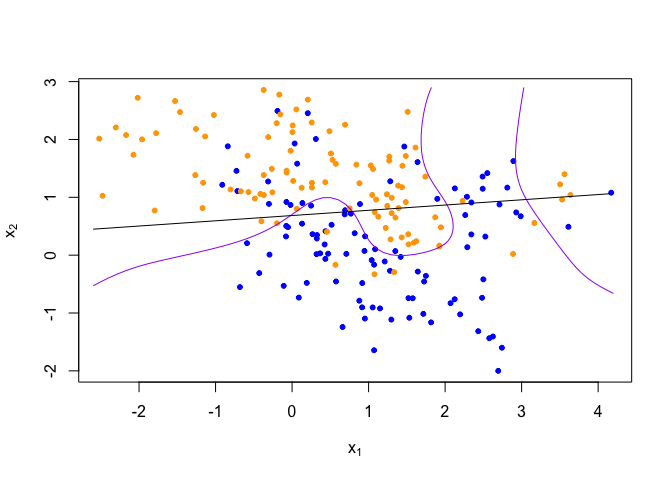
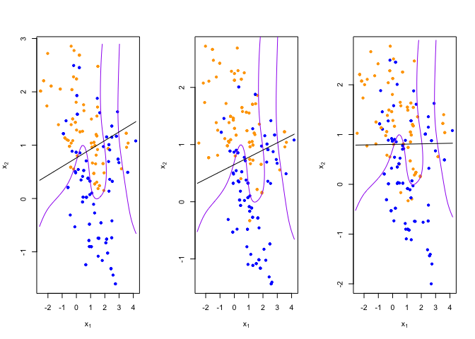
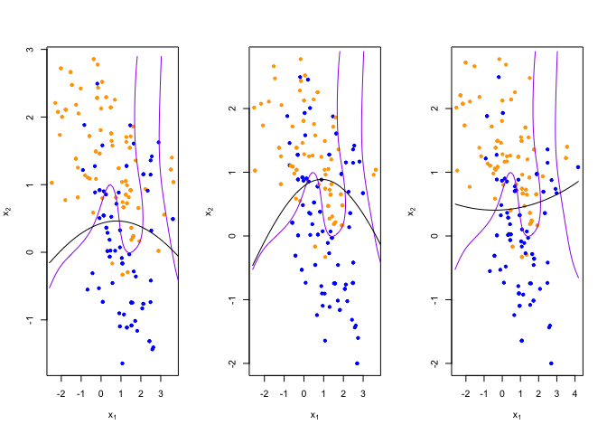
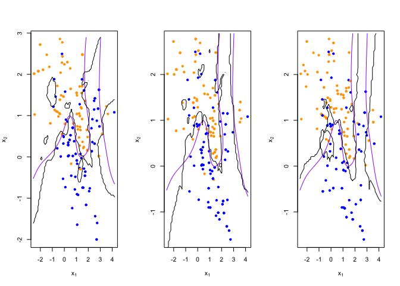
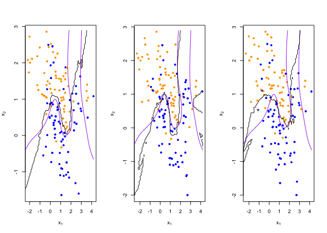

Homework 1
================
Ricky Sun
1/18/2023

Using the RMarkdown/knitr/github mechanism, implement the following
tasks by extending the example R script mixture-data-lin-knn.R: Paste
the code from the mixture-data-lin-knn.R file into the homework template
Knitr document. Read the help file for R’s built-in linear regression
function lm Re-write the functions fit_lc and predict_lc using lm, and
the associated predict method for lm objects. Consider making the linear
classifier more flexible, by adding squared terms for x1 and x2 to the
linear model Describe how this more flexible model affects the
bias-variance tradeoff

## load package

``` r
library('class')
library('tidyverse')
```

    ## ── Attaching packages ─────────────────────────────────────── tidyverse 1.3.2 ──
    ## ✔ ggplot2 3.4.0      ✔ purrr   0.3.5 
    ## ✔ tibble  3.1.8      ✔ dplyr   1.0.10
    ## ✔ tidyr   1.2.1      ✔ stringr 1.4.1 
    ## ✔ readr   2.1.2      ✔ forcats 0.5.1 
    ## ── Conflicts ────────────────────────────────────────── tidyverse_conflicts() ──
    ## ✖ dplyr::filter() masks stats::filter()
    ## ✖ dplyr::lag()    masks stats::lag()

## load data

``` r
## load binary classification example data from author website 
## 'ElemStatLearn' package no longer available
load(url('https://web.stanford.edu/~hastie/ElemStatLearn/datasets/ESL.mixture.rda'))
dat <- ESL.mixture
```

## Data overview

``` r
plot_mix_data <- function(dat, datboot=NULL) {
  if(!is.null(datboot)) {
    dat$x <- datboot$x
    dat$y <- datboot$y
  }
  plot(dat$x[,1], dat$x[,2],
       col=ifelse(dat$y==0, 'blue', 'orange'),
       pch=20,
       xlab=expression(x[1]),
       ylab=expression(x[2]))
  ## draw Bayes (True) classification boundary
  prob <- matrix(dat$prob, length(dat$px1), length(dat$px2))
  cont <- contourLines(dat$px1, dat$px2, prob, levels=0.5)
  rslt <- sapply(cont, lines, col='purple')
}

plot_mix_data(dat)
```

<!-- -->

## fit linear classifier

``` r
# fit_lc <- function(y, x) {
#   x <- cbind(1, x)
#   beta <- drop(solve(t(x)%*%x)%*%t(x)%*%y)
# }

fit_lc <- function(y, x) {
  beta <- lm(y~x)
}

fit_lc_square <- function(y, x) {
  x_squared1 = (x[,1])^2
  x_squared2 = (x[,2])^2
  beta <- lm(y~x+x_squared1+x_squared2)
}
```

``` r
# fit = lm(y~x)
# dat = data.frame(y=y, x=x)
# predict(fit)
```

## make predictions from linear classifier

``` r
# predict_lc <- function(x, beta) {
#   cbind(1, x) %*% beta
# }

predict_lc <- function(x, beta) {
  cbind(1, x) %*% beta$coefficients
}

predict_lc_square <- function(x, beta) {
  cbind(1, x, (x[,1])^2, (x[,2])^2) %*% beta$coefficients
}
```

## fit model to mixture data and make predictions

``` r
# linear terms
lc_beta <- fit_lc(dat$y, dat$x)
lc_pred <- predict_lc(dat$xnew, lc_beta)

# squared terms
lc_beta_square <- fit_lc_square(dat$y, (dat$x))
lc_pred_square <- predict_lc_square(dat$xnew, lc_beta_square)
```

## reshape predictions as a matrix for linear model (no squared terms)

``` r
lc_pred <- matrix(lc_pred, length(dat$px1), length(dat$px2))
contour(lc_pred,
        xlab=expression(x[1]),
        ylab=expression(x[2]))
```

<!-- -->

## find the contours in 2D space such that lc_pred == 0.5

``` r
lc_cont <- contourLines(dat$px1, dat$px2, lc_pred, levels=0.5)
```

## plot data and decision surface for linear model (no squared terms)

``` r
plot_mix_data(dat)
sapply(lc_cont, lines)
```

<!-- -->

    ## [[1]]
    ## NULL

# Adding Squared Terms

## reshape predictions as a matrix for linear model (with squared terms)

``` r
lc_pred_square <- matrix(lc_pred_square, length(dat$px1), length(dat$px2))
contour(lc_pred_square,
        xlab=expression(x[1]),
        ylab=expression(x[2]))
```

<!-- -->

## find the contours in 2D space such that lc_pred_square == 0.5

``` r
lc_cont <- contourLines(dat$px1, dat$px2, lc_pred_square, levels=0.5)
```

## plot data and decision surface for linear model (with squared terms)

``` r
plot_mix_data(dat)
sapply(lc_cont, lines)
```

<!-- -->

    ## [[1]]
    ## NULL

## do bootstrap to get a sense of variance in decision surface

``` r
resample <- function(dat) {
  idx <- sample(1:length(dat$y), replace = T)
  dat$y <- dat$y[idx]
  dat$x <- dat$x[idx,]
  return(dat)
}
```

## plot linear classifier (no squared terms) for three bootstraps

``` r
par(mfrow=c(1,3))
for(b in 1:3) {
  datb <- resample(dat)
  ## fit model to mixture data and make predictions
  lc_beta <- fit_lc(datb$y, datb$x)
  lc_pred <- predict_lc(datb$xnew, lc_beta)
  
  ## reshape predictions as a matrix
  lc_pred <- matrix(lc_pred, length(datb$px1), length(datb$px2))
  
  ## find the contours in 2D space such that lc_pred == 0.5
  lc_cont <- contourLines(datb$px1, datb$px2, lc_pred, levels=0.5)
  
  ## plot data and decision surface
  plot_mix_data(dat, datb)
  sapply(lc_cont, lines)
}
```

<!-- -->

## plot linear classifier (with squared terms) for three bootstraps

``` r
par(mfrow=c(1,3))
for(b in 1:3) {
  datb <- resample(dat)
  ## fit model to mixture data and make predictions
  lc_beta_square <- fit_lc_square(datb$y, datb$x)
  lc_pred_square <- predict_lc_square(datb$xnew, lc_beta_square)
  
  ## reshape predictions as a matrix
  lc_pred_square <- matrix(lc_pred_square, length(datb$px1), length(datb$px2))
  
  ## find the contours in 2D space such that lc_pred_square == 0.5
  lc_cont <- contourLines(datb$px1, datb$px2, lc_pred_square, levels=0.5)
  
  ## plot data and decision surface
  plot_mix_data(dat, datb)
  sapply(lc_cont, lines)
}
```

<!-- -->

## plot 5-NN classifier for three bootstraps

``` r
par(mfrow=c(1,3))
for(b in 1:3) {
  datb <- resample(dat)
  
  knn_fit <- knn(train=datb$x, test=datb$xnew, cl=datb$y, k=5, prob=TRUE)
  knn_pred <- attr(knn_fit, 'prob')
  knn_pred <- ifelse(knn_fit == 1, knn_pred, 1-knn_pred)
  
  ## reshape predictions as a matrix
  knn_pred <- matrix(knn_pred, length(datb$px1), length(datb$px2))
  
  ## find the contours in 2D space such that knn_pred == 0.5
  knn_cont <- contourLines(datb$px1, datb$px2, knn_pred, levels=0.5)
  
  ## plot data and decision surface
  plot_mix_data(dat, datb)
  sapply(knn_cont, lines)
}
```

<!-- -->

## plot 20-NN classifier for three bootstraps

``` r
par(mfrow=c(1,3))
for(b in 1:3) {
  datb <- resample(dat)
  
  knn_fit <- knn(train=datb$x, test=datb$xnew, cl=datb$y, k=20, prob=TRUE)
  knn_pred <- attr(knn_fit, 'prob')
  knn_pred <- ifelse(knn_fit == 1, knn_pred, 1-knn_pred)
  
  ## reshape predictions as a matrix
  knn_pred <- matrix(knn_pred, length(datb$px1), length(datb$px2))
  
  ## find the contours in 2D space such that knn_pred == 0.5
  knn_cont <- contourLines(datb$px1, datb$px2, knn_pred, levels=0.5)
  
  ## plot data and decision surface
  plot_mix_data(dat, datb)
  sapply(knn_cont, lines)
}
```

<!-- -->

## Describe how this more flexible model affects the bias-variance tradeoff

Adding squared terms to the model (make the model more flexible) seems
to lower the biases (the true value seems to be non-linear and have
higher power (such as squared) relations) but this could increase the
variance of the model and make the model more likely to overfit. But in
general, this more flexible model seems to have a better balance (as
compared to the model without squared terms) of bias-variance and the
variance may not increase a lot as compared to the lowering in biases.
