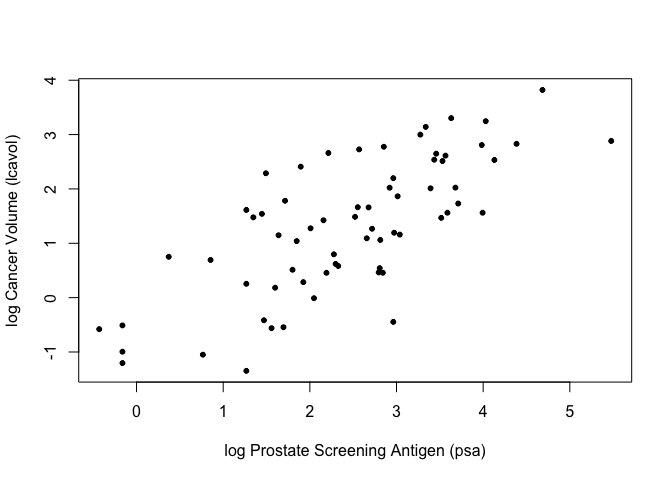

Homework 2
================
Ricky Sun
1/25/2023

# Instructions

Write functions that implement the L1 loss and tilted absolute loss
functions.

Create a figure that shows lpsa (x-axis) versus lcavol (y-axis). Add and
label (using the ‘legend’ function) the linear model predictors
associated with L2 loss, L1 loss, and tilted absolute value loss for tau
= 0.25 and 0.75.

Write functions to fit and predict from a simple nonlinear model with
three parameters defined by ‘beta\[1\] + beta\[2\]*exp(-beta\[3\]*x)’.
Hint: make copies of ‘fit_lin’ and ‘predict_lin’ and modify them to fit
the nonlinear model. Use c(-1.0, 0.0, -0.3) as ‘beta_init’.

Create a figure that shows lpsa (x-axis) versus lcavol (y-axis). Add and
label (using the ‘legend’ function) the nonlinear model predictors
associated with L2 loss, L1 loss, and tilted absolute value loss for tau
= 0.25 and 0.75.

## load packages

``` r
library(tidyverse)
```

    ## ── Attaching packages ─────────────────────────────────────── tidyverse 1.3.2 ──
    ## ✔ ggplot2 3.4.0      ✔ purrr   0.3.5 
    ## ✔ tibble  3.1.8      ✔ dplyr   1.0.10
    ## ✔ tidyr   1.2.1      ✔ stringr 1.4.1 
    ## ✔ readr   2.1.2      ✔ forcats 0.5.1 
    ## ── Conflicts ────────────────────────────────────────── tidyverse_conflicts() ──
    ## ✖ dplyr::filter() masks stats::filter()
    ## ✖ dplyr::lag()    masks stats::lag()

``` r
library(qrnn)
```

## load prostate data

``` r
prostate <- 
  read.table(url(
    'https://web.stanford.edu/~hastie/ElemStatLearn/datasets/prostate.data'))
```

## Subsetting & and A Glimpse

### subset to training examples

``` r
prostate_train <- subset(prostate, train==TRUE)
```

### plot lcavol vs lpsa

``` r
plot_psa_data <- function(dat=prostate_train) {
  plot(dat$lpsa, dat$lcavol,
       xlab="log Prostate Screening Antigen (psa)",
       ylab="log Cancer Volume (lcavol)",
       pch = 20)
}
plot_psa_data()
```

<!-- -->

## loss functions

``` r
L2_loss <- function(y, yhat){
  (y-yhat)^2
}

L1_loss <- function(y, yhat){
  abs(y-yhat)
}

# We can certainly use the tilted.abs(x,tau) function as well

tilted_abs_loss_25 <- function(y, yhat){
  diff = y - yhat
  ifelse(diff>0, diff*0.25, diff*(0.25-1))
}

tilted_abs_loss_75 <- function(y, yhat){
  diff = y - yhat
  ifelse(diff>0, diff*0.75, diff*(0.75-1))
}
```

## Linear Model

### Define Functions

``` r
## fit simple linear model using numerical optimization
### beta_init = c(-0.51, 0.75)
### beta[1] + beta[2]*x
fit_lin <- function(y, x, loss, beta_init = c(-0.51, 0.75)) {
  err <- function(beta)
    mean(loss(y,  beta[1] + beta[2]*x))
  beta <- optim(par = beta_init, fn = err)
  return(beta)
}

## make predictions from linear model
predict_lin <- function(x, beta){
  beta[1] + beta[2]*x
}

## fit linear model
lin_beta <- fit_lin(y=prostate_train$lcavol,
                    x=prostate_train$lpsa,
                    loss=L2_loss)

## compute predictions for a grid of inputs
x_grid <- seq(min(prostate_train$lpsa),
              max(prostate_train$lpsa),
              length.out=100)

lin_pred <- predict_lin(x=x_grid, beta=lin_beta$par)
```

### Fitting

``` r
lin_beta_l1 <- fit_lin(y=prostate_train$lcavol,
                           x=prostate_train$lpsa,
                           loss=L1_loss)

lin_pred_l1 <- predict_lin(x=x_grid, beta=lin_beta_l1$par)

lin_beta_l2 <- fit_lin(y=prostate_train$lcavol,
                    x=prostate_train$lpsa,
                    loss=L2_loss)
lin_pred_l2 <- predict_lin(x=x_grid, beta=lin_beta_l2$par)


lin_beta_tau_25<- fit_lin(y=prostate_train$lcavol,
                    x=prostate_train$lpsa,
                    loss=tilted_abs_loss_25)
lin_pred_tau_25 <- predict_lin(x=x_grid, beta=lin_beta_tau_25$par)

lin_beta_tau_75 <- fit_lin(y=prostate_train$lcavol,
                    x=prostate_train$lpsa,
                    loss=tilted_abs_loss_75)
lin_pred_tau_75 <- predict_lin(x=x_grid, beta=lin_beta_tau_75$par)
```

### Plotting

``` r
# plot data
plot_psa_data()

# plot predictions using L1 and L2 loss
lines(x=x_grid, y=lin_pred_l1, col='#284E60', lwd=2)
lines(x=x_grid, y=lin_pred_l2, col='#F99B45', lwd=2)

# plot predictions using tilted absolute loss with tau = 0.25 or tau = 0.75 (quantile regression)
lines(x=x_grid, y=lin_pred_tau_25, col='#63AAC0', lwd=2, lty=2)
lines(x=x_grid, y=lin_pred_tau_75, col='#D95980', lwd=2, lty=2)

# Add legend
legend("topleft", c("L1", "L2", "0.25 tau", "0.75 tau"), col=c("#284E60", "#F99B45", "#63AAC0", "#D95980"), 
       lty = c(1, 1, 2, 2))
```

<!-- -->

## Non-Linear Model

### Define Functions

``` r
## fit simple linear model using numerical optimization
### beta_init = c(-1.0, 0.0, -0.3
### beta[1] + beta[2]*exp(-beta[3]*x)
fit_non_lin <- function(y, x, loss, beta_init = c(-1.0, 0.0, -0.3)) {
  err <- function(beta)
    mean(loss(y,  beta[1] + beta[2]*exp(-beta[3]*x)))
  beta <- optim(par = beta_init, fn = err)
  return(beta)
}

## make predictions from linear model
predict_non_lin <- function(x, beta){
  beta[1] + beta[2]*exp(-beta[3]*x)
}

## fit linear model
non_lin_beta <- fit_non_lin(y=prostate_train$lcavol,
                    x=prostate_train$lpsa,
                    loss=L2_loss)

## compute predictions for a grid of inputs
x_grid <- seq(min(prostate_train$lpsa),
              max(prostate_train$lpsa),
              length.out=100)

non_lin_pred <- predict_non_lin(x=x_grid, beta=non_lin_beta$par)
```

### Fitting

``` r
non_lin_beta_l1 <- fit_non_lin(y=prostate_train$lcavol,
                           x=prostate_train$lpsa,
                           loss=L1_loss)

non_lin_pred_l1 <- predict_non_lin(x=x_grid, beta=non_lin_beta_l1$par)

non_lin_beta_l2 <- fit_non_lin(y=prostate_train$lcavol,
                    x=prostate_train$lpsa,
                    loss=L2_loss)
non_lin_pred_l2 <- predict_non_lin(x=x_grid, beta=non_lin_beta_l2$par)


non_lin_beta_tau_25<- fit_non_lin(y=prostate_train$lcavol,
                    x=prostate_train$lpsa,
                    loss=tilted_abs_loss_25)
non_lin_pred_tau_25 <- predict_non_lin(x=x_grid, beta=non_lin_beta_tau_25$par)

non_lin_beta_tau_75 <- fit_non_lin(y=prostate_train$lcavol,
                    x=prostate_train$lpsa,
                    loss=tilted_abs_loss_75)
non_lin_pred_tau_75 <- predict_non_lin(x=x_grid, beta=non_lin_beta_tau_75$par)
```

### Plotting

``` r
# plot data
plot_psa_data()

# plot predictions using L1 and L2 loss
lines(x=x_grid, y=non_lin_pred_l1, col='#284E60', lwd=2)
lines(x=x_grid, y=non_lin_pred_l2, col='#F99B45', lwd=2)

# plot predictions using tilted absolute loss with tau = 0.25 or tau = 0.75 (quantile regression)
lines(x=x_grid, y=non_lin_pred_tau_25, col='#63AAC0', lwd=2)
lines(x=x_grid, y=non_lin_pred_tau_75, col='#D95980', lwd=2)

# Add legend
legend("topleft", c("L1", "L2", "0.25 tau", "0.75 tau"), col=c("#284E60", "#F99B45", "#63AAC0", "#D95980"), 
       lty = c(1, 1, 1, 1))
```

<!-- -->
