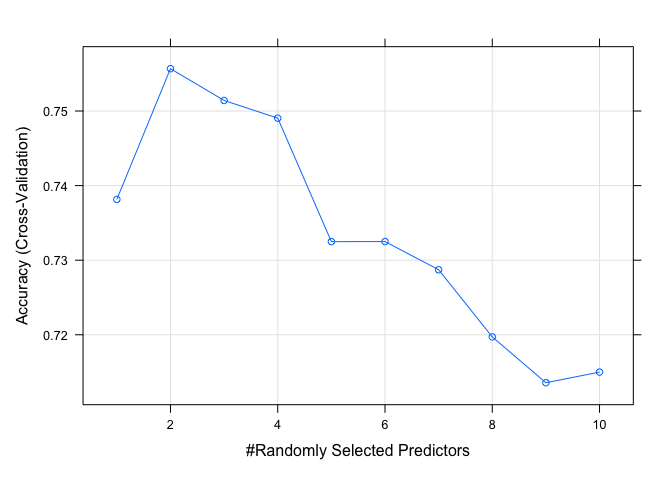

homework 5
================
Ricky Sun
2023-04-03

# load data and packages

``` r
library('randomForest')  ## fit random forest
```

    ## randomForest 4.7-1.1

    ## Type rfNews() to see new features/changes/bug fixes.

``` r
library('dplyr')    ## data manipulation
```

    ## 
    ## Attaching package: 'dplyr'

    ## The following object is masked from 'package:randomForest':
    ## 
    ##     combine

    ## The following objects are masked from 'package:stats':
    ## 
    ##     filter, lag

    ## The following objects are masked from 'package:base':
    ## 
    ##     intersect, setdiff, setequal, union

``` r
library('tidyverse')
```

    ## ── Attaching packages
    ## ───────────────────────────────────────
    ## tidyverse 1.3.2 ──

    ## ✔ ggplot2 3.4.0     ✔ purrr   0.3.5
    ## ✔ tibble  3.1.8     ✔ stringr 1.4.1
    ## ✔ tidyr   1.2.1     ✔ forcats 0.5.1
    ## ✔ readr   2.1.2     
    ## ── Conflicts ────────────────────────────────────────── tidyverse_conflicts() ──
    ## ✖ dplyr::combine()  masks randomForest::combine()
    ## ✖ dplyr::filter()   masks stats::filter()
    ## ✖ dplyr::lag()      masks stats::lag()
    ## ✖ ggplot2::margin() masks randomForest::margin()

``` r
library('magrittr') ## for '%<>%' operator
```

    ## 
    ## Attaching package: 'magrittr'
    ## 
    ## The following object is masked from 'package:purrr':
    ## 
    ##     set_names
    ## 
    ## The following object is masked from 'package:tidyr':
    ## 
    ##     extract

``` r
library('gpairs')   ## pairs plot
library('viridis')  ## viridis color palette
```

    ## Loading required package: viridisLite

``` r
library('caret')
```

    ## Loading required package: lattice
    ## 
    ## Attaching package: 'caret'
    ## 
    ## The following object is masked from 'package:purrr':
    ## 
    ##     lift

``` r
library('corrplot')
```

    ## corrplot 0.92 loaded

``` r
library('ggplot2')
```

``` r
vowel = read_csv(url('https://hastie.su.domains/ElemStatLearn/datasets/vowel.train'))
```

    ## Rows: 528 Columns: 12
    ## ── Column specification ────────────────────────────────────────────────────────
    ## Delimiter: ","
    ## dbl (12): row.names, y, x.1, x.2, x.3, x.4, x.5, x.6, x.7, x.8, x.9, x.10
    ## 
    ## ℹ Use `spec()` to retrieve the full column specification for this data.
    ## ℹ Specify the column types or set `show_col_types = FALSE` to quiet this message.

``` r
vowel2<- read.csv(url('https://hastie.su.domains/ElemStatLearn/datasets/vowel.test'))
```

Goal: Understand and implement a random forest classifier.

Using the “vowel.train” data, develop a random forest (e.g., using the
“randomForest” package) or gradient boosted classifier for the vowel
data.

Fit a random forest or gradient boosted model to the “vowel.train” data
using all of the 11 features using the default values of the tuning
parameters.

``` r
vowel <- vowel %>% 
  select(-row.names) %>% 
  mutate(y = as.factor(y))

vowel2 <- vowel2 %>% 
  select(-row.names) %>% 
  mutate(y = as.factor(y))

fit <- randomForest(y ~ ., data=vowel)
# ntree=500, mtry=2, proximity=TRUE)
```

Use 5-fold CV to tune the number of variables randomly sampled as
candidates at each split if using random forest, or the ensemble size if
using gradient boosting.

``` r
set.seed('666')
vowel_folds  <- createFolds(vowel$y, k=5)
print(vowel_folds)
```

    ## $Fold1
    ##   [1]   3   6   7  12  13  15  16  28  30  38  43  44  47  53  65  79  84  86
    ##  [19]  93 101 102 103 107 111 120 128 129 133 142 149 150 152 154 156 158 165
    ##  [37] 178 179 184 191 205 207 208 214 222 226 237 243 244 247 258 262 267 268
    ##  [55] 270 273 274 278 282 289 290 297 303 315 327 330 346 354 356 362 371 372
    ##  [73] 373 378 380 382 385 386 388 398 401 404 418 419 420 424 427 436 441 447
    ##  [91] 450 454 456 459 463 466 470 484 485 490 491 495 516 517 526
    ## 
    ## $Fold2
    ##   [1]   2   9  21  23  29  36  40  48  54  56  60  63  83  85  90  91  92  94
    ##  [19]  95  97 100 104 106 108 112 115 117 121 130 136 139 145 148 167 169 171
    ##  [37] 175 176 181 188 194 196 201 210 211 212 220 228 240 252 253 256 259 261
    ##  [55] 264 266 269 288 294 300 307 309 311 314 318 319 333 336 338 339 349 351
    ##  [73] 357 359 360 363 366 367 369 374 375 384 389 390 393 397 408 411 413 414
    ##  [91] 422 430 431 438 439 443 444 445 451 453 460 482 502 506 511 523
    ## 
    ## $Fold3
    ##   [1]  18  20  22  24  34  45  46  50  52  59  61  64  66  67  68  69  71  72
    ##  [19]  73  77  78  80  81  82 113 118 119 126 140 143 144 153 160 161 163 168
    ##  [37] 172 177 186 189 193 195 198 203 206 216 219 230 233 235 236 241 245 250
    ##  [55] 251 255 257 271 284 286 292 293 295 316 325 329 331 334 335 347 350 352
    ##  [73] 355 364 377 392 395 399 400 406 409 415 416 428 429 433 434 448 452 457
    ##  [91] 469 473 475 478 479 489 492 496 499 509 510 519 520 521 524
    ## 
    ## $Fold4
    ##   [1]   4   5  10  17  19  27  31  32  33  35  42  51  55  57  62  74  75  88
    ##  [19]  89  96  98 105 109 110 114 116 122 123 125 127 131 134 147 157 170 173
    ##  [37] 174 180 182 183 192 202 213 215 217 218 223 224 225 232 234 242 246 249
    ##  [55] 260 272 275 276 279 280 281 287 291 296 298 299 302 305 306 308 310 313
    ##  [73] 321 326 328 337 341 342 370 379 396 405 407 410 421 425 432 435 437 442
    ##  [91] 449 465 468 472 474 476 481 483 486 487 505 507 512 515 527
    ## 
    ## $Fold5
    ##   [1]   1   8  11  14  25  26  37  39  41  49  58  70  76  87  99 124 132 135
    ##  [19] 137 138 141 146 151 155 159 162 164 166 185 187 190 197 199 200 204 209
    ##  [37] 221 227 229 231 238 239 248 254 263 265 277 283 285 301 304 312 317 320
    ##  [55] 322 323 324 332 340 343 344 345 348 353 358 361 365 368 376 381 383 387
    ##  [73] 391 394 402 403 412 417 423 426 440 446 455 458 461 462 464 467 471 477
    ##  [91] 480 488 493 494 497 498 500 501 503 504 508 513 514 518 522 525 528

``` r
sapply(vowel_folds, length)  
```

    ## Fold1 Fold2 Fold3 Fold4 Fold5 
    ##   105   106   105   105   107

``` r
train_control <- trainControl(method = "cv",
                              number = 5,
                              index = vowel_folds)

# Set a range of values for the "mtry" hyperparameter
mtry_values <- seq(1, ncol(vowel) - 1, by = 1) 

# Train the model using random forest and tune the "mtry" hyperparameter
model <- train(y ~ ., 
               data = vowel,
               method = "rf",
               metric = "Accuracy", 
               trControl = train_control,
               tuneGrid = expand.grid(.mtry = mtry_values))


print(model$bestTune)
```

    ##   mtry
    ## 2    2

``` r
print(model$results)
```

    ##    mtry  Accuracy     Kappa AccuracySD    KappaSD
    ## 1     1 0.7381528 0.7119762 0.01457992 0.01603827
    ## 2     2 0.7556794 0.7312540 0.03574124 0.03930479
    ## 3     3 0.7514173 0.7265670 0.03080993 0.03388178
    ## 4     4 0.7490420 0.7239551 0.02897730 0.03185928
    ## 5     5 0.7324857 0.7057427 0.02904351 0.03193740
    ## 6     6 0.7324992 0.7057560 0.03271609 0.03597915
    ## 7     7 0.7287223 0.7016069 0.04020387 0.04421653
    ## 8     8 0.7197164 0.6917011 0.02473154 0.02719604
    ## 9     9 0.7135732 0.6849468 0.03257960 0.03583155
    ## 10   10 0.7149984 0.6865117 0.03820546 0.04202392

``` r
plot(model)
```

<!-- --> Thus, it
seems that mtry = 5 seems to be the best performing parameter

With the tuned model, make predictions using the majority vote method,
and compute the misclassification rate using the ‘vowel.test’ data.

``` r
test_predictions <- predict(model, newdata = vowel2)
actual_values <- vowel2$y

confusion_mtx <- confusionMatrix(test_predictions, actual_values)
print(confusion_mtx)
```

    ## Confusion Matrix and Statistics
    ## 
    ##           Reference
    ## Prediction  1  2  3  4  5  6  7  8  9 10 11
    ##         1  32  1  0  0  0  0  0  0  0  4  0
    ##         2   9 24  3  0  0  0  0  0  0 13  1
    ##         3   1 13 30  3  0  0  0  0  0  2  0
    ##         4   0  0  4 30  3  1  0  0  0  0  2
    ##         5   0  0  0  0 18  6 10  0  0  0  0
    ##         6   0  0  3  8 16 23  1  0  0  0  5
    ##         7   0  0  0  0  3  0 26  7  5  0  2
    ##         8   0  0  0  0  0  0  0 30  5  1  0
    ##         9   0  4  0  0  0  0  5  5 23  2 13
    ##         10  0  0  0  0  0  0  0  0  3 20  0
    ##         11  0  0  2  1  2 12  0  0  6  0 19
    ## 
    ## Overall Statistics
    ##                                           
    ##                Accuracy : 0.5952          
    ##                  95% CI : (0.5489, 0.6403)
    ##     No Information Rate : 0.0909          
    ##     P-Value [Acc > NIR] : < 2.2e-16       
    ##                                           
    ##                   Kappa : 0.5548          
    ##                                           
    ##  Mcnemar's Test P-Value : NA              
    ## 
    ## Statistics by Class:
    ## 
    ##                      Class: 1 Class: 2 Class: 3 Class: 4 Class: 5 Class: 6
    ## Sensitivity           0.76190  0.57143  0.71429  0.71429  0.42857  0.54762
    ## Specificity           0.98810  0.93810  0.95476  0.97619  0.96190  0.92143
    ## Pos Pred Value        0.86486  0.48000  0.61224  0.75000  0.52941  0.41071
    ## Neg Pred Value        0.97647  0.95631  0.97094  0.97156  0.94393  0.95320
    ## Prevalence            0.09091  0.09091  0.09091  0.09091  0.09091  0.09091
    ## Detection Rate        0.06926  0.05195  0.06494  0.06494  0.03896  0.04978
    ## Detection Prevalence  0.08009  0.10823  0.10606  0.08658  0.07359  0.12121
    ## Balanced Accuracy     0.87500  0.75476  0.83452  0.84524  0.69524  0.73452
    ##                      Class: 7 Class: 8 Class: 9 Class: 10 Class: 11
    ## Sensitivity           0.61905  0.71429  0.54762   0.47619   0.45238
    ## Specificity           0.95952  0.98571  0.93095   0.99286   0.94524
    ## Pos Pred Value        0.60465  0.83333  0.44231   0.86957   0.45238
    ## Neg Pred Value        0.96181  0.97183  0.95366   0.94989   0.94524
    ## Prevalence            0.09091  0.09091  0.09091   0.09091   0.09091
    ## Detection Rate        0.05628  0.06494  0.04978   0.04329   0.04113
    ## Detection Prevalence  0.09307  0.07792  0.11255   0.04978   0.09091
    ## Balanced Accuracy     0.78929  0.85000  0.73929   0.73452   0.69881

``` r
# Calculate the misclassification rate
misclassification_rate <- 1 - confusion_mtx$overall["Accuracy"]
cat("Misclassification Rate:", misclassification_rate, "\n")
```

    ## Misclassification Rate: 0.4047619

In the context of a Random Forest classifier, the majority vote method
is implicitly used when making predictions. The Random Forest algorithm
consists of multiple decision trees, each trained on a different subset
of the dataset. When making a prediction, each decision tree provides a
class label, and the majority vote method is applied to select the final
prediction based on the class labels from all the decision trees.
